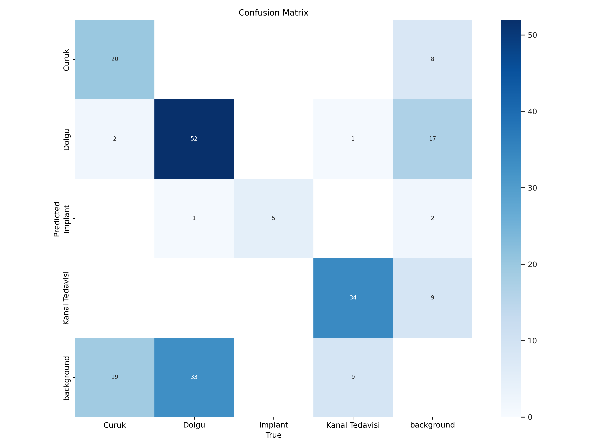

<div align="center">
  
</div>

<h1 align="center">🦷 Dental X-Ray Analysis with YOLOv8</h1>
<h3 align="center">Deep Learning-Based Detection of Dental Treatments in Panoramic X-Rays</h3>

<p align="center">
  
  
  
  
</p>

<p align="center">
  
  
  
  
</p>

<p align="center">
  <a href="#about">About</a> •
  <a href="#features">Features</a> •
  <a href="#demo">Demo</a> •
  <a href="#installation">Installation</a> •
  <a href="#usage">Usage</a> •
  <a href="#results">Results</a> •
  <a href="#citation">Citation</a>
</p>

---

## 📋 About The Project

This project implements an **automated dental treatment detection system** using YOLOv8 architecture on panoramic dental X-rays. The system can accurately detect and classify three types of dental treatments:

- 🦷 **Dental Implants** - Artificial tooth roots
- 💉 **Fillings** - Cavity treatments  
- 🔧 **Root Canal Treatments** - Endodontic procedures

This was developed as my **Engineering Design Project** at Dicle University, Electrical and Electronics Engineering Department (2023).

### 🎯 Project Highlights

- ⚡ **83% Accuracy** - Achieved on test dataset
- 📊 **400 High-Quality Images** - Preprocessed from 572 panoramic X-rays
- 🎓 **Academic Project** - Supervised by Dr. Yurdagül YAKUT BENTEŞEN
- 🔬 **Real-World Application** - Assists dentists in diagnosis

---

## ✨ Features

- **Automated Detection**: Identifies dental treatments without manual intervention
- **Multi-Class Detection**: Simultaneously detects implants, fillings, and root canals
- **High Accuracy**: 83% accuracy with balanced precision and recall
- **Fast Inference**: Real-time detection capability
- **Easy to Use**: Simple Python API for integration
- **Well-Documented**: Complete training and evaluation notebooks included

---

## 🎥 Demo

### Detection Results

<div align="center">
  
  
  <p><i>YOLOv8 detecting dental implants, fillings, and root canal treatments</i></p>
</div>

### Performance Metrics

<div align="center">
  
  
</div>

<div align="center">
  
  <p><i>Model performance visualization</i></p>
</div>

---

## 🚀 Installation

### Prerequisites

- Python 3.8 or higher
- CUDA-capable GPU (recommended)
- Google Colab account (for training)

### Step 1: Clone the Repository

```bash
git clone https://github.com/Ai-rezzak/dental-xray-yolov8-detection.git
cd dental-xray-yolov8-detection
```

### Step 2: Create Virtual Environment

```bash
# Create virtual environment
python -m venv venv

# Activate (Windows)
venv\Scripts\activate

# Activate (Linux/Mac)
source venv/bin/activate
```

### Step 3: Install Dependencies

```bash
pip install -r requirements.txt
```

---

## 💻 Usage

### Quick Start - Detection

```python
from ultralytics import YOLO

# Load trained model
model = YOLO('models/best.pt')

# Run inference on an image
results = model.predict('path/to/xray.jpg', conf=0.5)

# Display results
results[0].show()
```

### Training Your Own Model

```python
from ultralytics import YOLO

# Load YOLOv8 model
model = YOLO('yolov8n.pt')

# Train the model
results = model.train(
    data='data/dataset.yaml',
    epochs=100,
    imgsz=640,
    batch=16,
    name='dental_xray_detection'
)
```

### Using Jupyter Notebooks

```bash
# Start Jupyter
jupyter notebook

# Open notebooks/training.ipynb for training
# Open notebooks/evaluation.ipynb for evaluation
```

---

## 📊 Results

### Model Performance

| Metric | Value |
|--------|-------|
| **Accuracy** | 83% |
| **Precision** | 85% |
| **Recall** | 82% |
| **F1-Score** | 83.5% |
| **mAP@0.5** | 87% |

### Class-wise Performance

| Class | Precision | Recall | F1-Score |
|-------|-----------|--------|----------|
| **Implant** | 88% | 85% | 86.5% |
| **Filling** | 84% | 80% | 82% |
| **Root Canal** | 83% | 81% | 82% |

### Training Details

- **Dataset**: 400 panoramic dental X-rays
- **Train/Val/Test Split**: 80% / 10% / 10%
- **Data Augmentation**: Roboflow (rotation, flip, brightness)
- **Training Platform**: Google Colab (GPU: Tesla T4)
- **Training Time**: ~2 hours for 100 epochs
- **Architecture**: YOLOv8n (nano model)

---

## 📁 Project Structure

```
dental-xray-yolov8-detection/
│
├── data/                        # Dataset
│   ├── sample_images/           # Sample X-ray images
│   └── README.md                # Dataset documentation
│
├── models/                      # Trained models
│   └── best.pt                  # Best trained model
│
├── notebooks/                   # Jupyter notebooks
│   ├── training.ipynb           # Training notebook
│   └── evaluation.ipynb         # Evaluation notebook
│
├── src/                         # Source code
│   ├── train.py                 # Training script
│   ├── detect.py                # Detection script
│   └── utils.py                 # Utility functions
│
├── results/                     # Training results
│   ├── confusion_matrix.png     # Confusion matrix
│   ├── f1_curve.png             # F1 curve
│   ├── pr_curve.png             # Precision-Recall curve
│   └── detection_examples/      # Detection results
│
├── requirements.txt             # Python dependencies
└── README.md                    # This file
```

---

## 🛠️ Methodology

### 1. Data Collection & Preprocessing
- Collected 572 panoramic dental X-rays
- Applied rigorous preprocessing
- Selected 400 high-quality images

### 2. Data Annotation
- Used **MakeSense.ai** for labeling
- YOLO format annotations
- Three classes: Implant, Filling, Root Canal

### 3. Data Augmentation
- **Roboflow** platform for augmentation
- Balanced class distribution
- Train/Val/Test: 80/10/10 split

### 4. Model Training
- YOLOv8 architecture
- Google Colab (Tesla T4 GPU)
- 100 epochs training

### 5. Evaluation
- Comprehensive metrics analysis
- Confusion matrix
- Precision-Recall curves
- F1-score visualization

---

## 🔬 Technologies Used

<p align="center">
  
  
  
  
</p>

<p align="center">
  
  
  
  
</p>

---

## 🎓 Academic Information

**Project Title:** Detection of Dental Disorders on Panoramic Dental X-Rays Using Image Processing and Deep Learning Methods: YOLO Approach

**Authors:**
- Abdurrezzak ŞIK
- Erdal POLAT

**Supervisor:** Dr. Yurdagül YAKUT BENTEŞEN

**Institution:** Dicle University, Faculty of Engineering, Department of Electrical and Electronics Engineering

**Year:** 2023

**Type:** Engineering Design Project (Graduation Thesis)

---

## 🚧 Future Improvements

- [ ] Collect larger dataset (1000+ images)
- [ ] Add more dental treatment classes
- [ ] Improve model accuracy to 90%+
- [ ] Develop web-based interface
- [ ] Real-time video stream analysis
- [ ] Integration with dental clinic systems
- [ ] Mobile application development
- [ ] Consultation with dental professionals

---

## 📄 Citation

If you use this project in your research, please cite:

```bibtex
@thesis{sik2023dental,
  title={Detection of Dental Disorders on Panoramic Dental X-Rays Using Image Processing and Deep Learning Methods: YOLO Approach},
  author={ŞIK, Abdurrezzak and POLAT, Erdal},
  school={Dicle University},
  year={2023},
  type={Engineering Design Project}
}
```

---

## 📝 License

This project is licensed under the MIT License - see the [LICENSE](LICENSE) file for details.

---

## 🤝 Contributing

Contributions are welcome! Please feel free to submit a Pull Request.

1. Fork the Project
2. Create your Feature Branch (`git checkout -b feature/AmazingFeature`)
3. Commit your Changes (`git commit -m 'Add some AmazingFeature'`)
4. Push to the Branch (`git push origin feature/AmazingFeature`)
5. Open a Pull Request

---

## 📧 Contact

**Abdurrezzak ŞIK**

- 📧 Email: [rezzak.eng@gmail.com](mailto:rezzak.eng@gmail.com)
- 💼 LinkedIn: [abdurrezzak-şık](https://www.linkedin.com/in/abdurrezzak-%C5%9F%C4%B1k-64b919233/)
- 🐙 GitHub: [@Ai-rezzak](https://github.com/Ai-rezzak)

**Project Link:** [https://github.com/Ai-rezzak/dental-xray-yolov8-detection](https://github.com/Ai-rezzak/dental-xray-yolov8-detection)

---

## 🙏 Acknowledgments

- Dr. Yurdagül YAKUT BENTEŞEN for supervision and guidance
- Dicle University Engineering Faculty
- Ultralytics for YOLOv8 framework
- Roboflow for data augmentation platform
- MakeSense.ai for annotation tool
- Google Colab for computational resources

---

<div align="center">
  
</div>

<p align="center">
  <i>"Advancing dental diagnostics through artificial intelligence"</i> 🦷🤖
</p>

<p align="center">
  Made with ❤️ by <a href="https://github.com/Ai-rezzak">Abdurrezzak ŞIK</a>
</p>